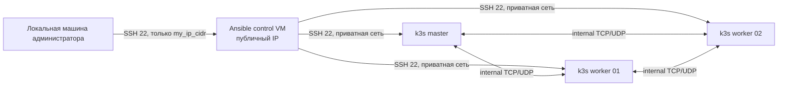

# CloudLab

CloudLab - Terraform-проект для разворачивания небольшой лабораторной инфраструктуры в Cloud.ru Evolution. Сейчас проект создает отдельную подсеть, группы безопасности, управляющую ВМ для Ansible и три приватные k3s-ноды: один master и два worker.

В README намеренно не указываются реальные значения ключей, идентификаторов проекта, IP-адресов, содержимое state-файлов и SSH-ключей. Эти данные могут быть чувствительными и должны оставаться только в локальных файлах или защищенном хранилище секретов.

## Что разворачивается

Инфраструктура состоит из следующих компонентов:

- **Cloud.ru Evolution provider** - подключение к API Cloud.ru через Terraform-провайдер `cloud.ru/cloudru/cloud`.
- **Подсеть CloudLab** - отдельная routed subnet внутри существующего VPC.
- **Ansible control node** - ВМ с публичным IP, через которую предполагается управлять остальными серверами.
- **k3s master node** - приватная ВМ для control-plane k3s.
- **k3s worker nodes** - две приватные ВМ для рабочих нод k3s.
- **Security groups** - правила доступа для SSH, внутреннего трафика кластера и исходящих соединений.
- **cloud-init** - первичная настройка пользователей, SSH-доступа и базовых пакетов на ВМ.



## Структура проекта

```text
.
├── .gitignore
├── README.md
└── terraform/
    ├── .terraform.lock.hcl
    ├── ansible-ctrl.tf
    ├── cloud-init.tf
    ├── cloud-init.yaml.tpl
    ├── images.tf
    ├── k3s-nodes.tf
    ├── k3s-security.tf
    ├── locals.tf
    ├── network.tf
    ├── outputs.tf
    ├── providers.tf
    ├── variables.tf
    ├── versions.tf
    ├── terraform.tfvars              # локальный файл с реальными значениями
    ├── terraform.tfstate             # локальное состояние Terraform
    ├── terraform.tfstate.backup      # резервная копия состояния
    ├── tfplan                        # локальный план Terraform
    ├── keys/
    │   └── ansible_k3s_ed25519.pub   # публичный SSH-ключ
    └── .terraform/                   # локальные файлы Terraform после init
```

## Файлы в корне

| Файл | Назначение |
| --- | --- |
| `.gitignore` | Запрещает попадание в Git локальных артефактов Terraform: `.terraform/`, `*.tfstate`, `terraform.tfvars`, `tfplan`, `keys/` и похожих файлов. Это особенно важно, потому что state и tfvars могут содержать секреты, IP-адреса, ID ресурсов и другие чувствительные данные. |
| `README.md` | Документация проекта: описание архитектуры, файлов, переменных, команд запуска и правил безопасной работы. |

## Terraform-файлы

| Файл | За что отвечает |
| --- | --- |
| `terraform/versions.tf` | Задает минимальную версию Terraform (`>= 1.12.0`) и фиксирует требуемый провайдер `cloud.ru/cloudru/cloud` версии `2.0.0`. |
| `terraform/providers.tf` | Настраивает провайдер Cloud.ru Evolution: использует `project_id`, `auth_key_id` и `auth_secret`, а также задает IAM и Compute endpoints. Реальные значения передаются через переменные, а не хранятся в коде. |
| `terraform/variables.tf` | Описывает все входные переменные проекта: название проекта, ID проекта и VPC, ключи авторизации, SSH-ключи, CIDR для доступа, подсеть, зону, размеры дисков, flavors ВМ и имя Ubuntu-образа. Переменные `auth_key_id` и `auth_secret` помечены как sensitive. |
| `terraform/locals.tf` | Формирует единый префикс имен и итоговые имена ВМ: Ansible controller, k3s master и два k3s worker. Это помогает держать нейминг ресурсов консистентным. |
| `terraform/network.tf` | Создает routed subnet для лаборатории и security group для Ansible control node. Разрешает SSH на Ansible только с `my_ip_cidr`, а также исходящий TCP/UDP-трафик наружу. |
| `terraform/images.tf` | Получает коллекцию образов Cloud.ru и выбирает ID Ubuntu-образа по имени из переменной `ubuntu_image_name`. Этот ID используется для k3s-нод. |
| `terraform/cloud-init.yaml.tpl` | Шаблон cloud-init для ВМ. Создает пользователя, добавляет его в `sudo`, включает SSH-доступ по публичному ключу, ставит базовые пакеты (`curl`, `wget`, `git`, `vim`, `htop`, `python3` и другие), включает и запускает SSH-сервис. |
| `terraform/cloud-init.tf` | Читает публичные SSH-ключи из локальных путей, рендерит cloud-init для Ansible VM и каждой k3s-ноды. Также содержит sensitive output с preview cloud-init для Ansible controller. |
| `terraform/ansible-ctrl.tf` | Описывает ресурсы Ansible control node: boot disk, network interface с новым публичным IP и саму ВМ. Для диска сейчас явно выбирается образ `Ubuntu-24.04`. |
| `terraform/k3s-nodes.tf` | Описывает k3s-ноды через `for_each`: master, worker 01 и worker 02. Для каждой ноды создаются boot disk, network interface без публичного IP и ВМ с cloud-init. |
| `terraform/k3s-security.tf` | Создает security group для k3s-нод. Разрешает SSH только от внутреннего IP Ansible control node, внутренний TCP/UDP-трафик внутри подсети CloudLab и исходящий TCP/UDP-трафик наружу. |
| `terraform/outputs.tf` | Выводит полезные значения после применения Terraform: имена ВМ, ID Ansible VM, внутренний и публичный IP Ansible controller, готовую SSH-команду и приватные IP k3s-нод. |
| `terraform/.terraform.lock.hcl` | Lock-файл Terraform-провайдера. Он фиксирует выбранную версию и хеш провайдера, чтобы повторные `terraform init` были воспроизводимыми. В текущем `.gitignore` этот файл исключен из Git. |

## Локальные и чувствительные файлы

Эти файлы есть или могут появляться в рабочей директории, но их содержимое нельзя переносить в README, коммиты, публичные чаты или issue:

| Файл или каталог | Что это такое | Почему осторожно |
| --- | --- | --- |
| `terraform/terraform.tfvars` | Локальные значения переменных Terraform. | Может содержать реальные `project_id`, `auth_key_id`, `auth_secret`, VPC ID, IP-адрес администратора и пути к ключам. |
| `terraform/terraform.tfstate` | Текущее состояние Terraform. | Может содержать ID ресурсов, IP-адреса, сгенерированные значения, фрагменты rendered cloud-init и другие данные инфраструктуры. Флаг `sensitive` скрывает вывод в CLI, но не делает state-файл безопасным для публикации. |
| `terraform/terraform.tfstate.backup` | Резервная копия предыдущего state. | Несет те же риски, что и основной state-файл. |
| `terraform/tfplan`, `terraform/*.tfplan` | Сохраненные планы Terraform. | Могут содержать значения переменных и детали будущих изменений инфраструктуры. |
| `terraform/keys/ansible_k3s_ed25519.pub` | Публичный SSH-ключ для доступа Ansible control node к k3s-нодам. | Значение ключа не дублируется в README. Приватная часть этого ключа не должна попадать в репозиторий. |
| `terraform/keys/` | Локальный каталог для SSH-ключей. | Приватные ключи нельзя хранить в Git. Публичные ключи тоже лучше не дублировать без необходимости. |
| `terraform/.terraform/` | Локальный каталог Terraform после `terraform init`, включая скачанные провайдеры. | Это машинно-зависимый кэш, его не нужно коммитить или документировать по содержимому. |
| `terraform/.terraform/providers/cloud.ru/cloudru/cloud/2.0.0/windows_amd64/terraform-provider-cloud_2.0.0_windows_amd64` | Скачанный бинарник Terraform-провайдера Cloud.ru для Windows AMD64. | Генерируется локально командой `terraform init`; хранить в Git не нужно. |

## Переменные

Основные переменные задаются в `terraform/variables.tf`, а реальные значения обычно кладутся в локальный `terraform.tfvars` или передаются через переменные окружения/CI.

Пример структуры `terraform.tfvars` с плейсхолдерами:

```hcl
project_name = "cloudlab"

project_id  = "<cloudru-project-id>"
vpc_id      = "<cloudru-vpc-id>"
auth_key_id = "<cloudru-service-account-key-id>"
auth_secret = "<cloudru-service-account-key-secret>"

my_ip_cidr = "<your-public-ip>/32"

ssh_public_key_path          = "<path-to-admin-public-key>"
ansible_to_k3s_public_key_path = "<path-to-ansible-to-k3s-public-key>"

ubuntu_image_name = "Ubuntu-24.04"
```

## Как запустить

Команды выполняются из каталога `terraform`:

```powershell
cd terraform
terraform init
terraform fmt
terraform validate
terraform plan -out=tfplan
terraform apply tfplan
```

После успешного `apply` Terraform выведет:

- имя Ansible control node;
- имена k3s-нод;
- ID Ansible VM;
- внутренний и публичный IP Ansible VM;
- готовую SSH-команду для подключения к Ansible VM;
- приватные IP-адреса k3s-нод.

Для удаления созданной инфраструктуры:

```powershell
cd terraform
terraform destroy
```

Перед `destroy` внимательно проверьте план удаления, чтобы не затронуть ресурсы, которые должны остаться.

## Как устроен доступ

- С локальной машины администратора SSH открыт только на Ansible control node и только с CIDR, заданного в `my_ip_cidr`.
- k3s-ноды не получают публичный IP в текущей конфигурации.
- SSH на k3s-ноды разрешен только с внутреннего IP Ansible control node.
- Внутри подсети CloudLab k3s-ноды могут общаться между собой по TCP и UDP.
- Все ВМ имеют исходящий TCP/UDP-доступ наружу для установки пакетов и дальнейшей настройки.

## Роли SSH-ключей

В проекте используются два разных публичных ключа:

- `ssh_public_key_path` - публичный ключ администратора для доступа с локальной машины к Ansible control node.
- `ansible_to_k3s_public_key_path` - публичный ключ, который добавляется на k3s-ноды, чтобы Ansible control node мог подключаться к ним по SSH.

## Текущие особенности конфигурации

- Ansible control node получает публичный IP, k3s-ноды - только приватные адреса.
- Для Ansible control node образ Ubuntu указан напрямую как `Ubuntu-24.04`.
- Для k3s-нод Ubuntu-образ выбирается через переменную `ubuntu_image_name`.
- Установка самого k3s в Terraform пока не описана: проект подготавливает ВМ и сетевой доступ, а дальнейшую настройку предполагается выполнять с Ansible control node.
- `cloud-init` ставит базовые утилиты и Python, что удобно для дальнейшего Ansible-провижининга.
